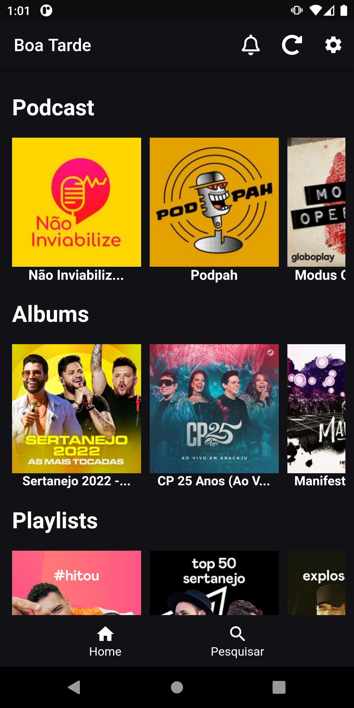
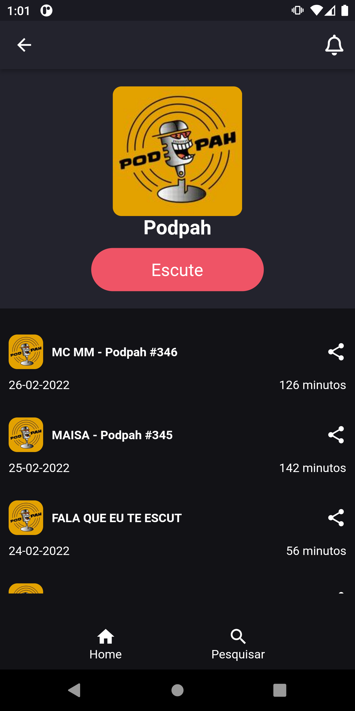
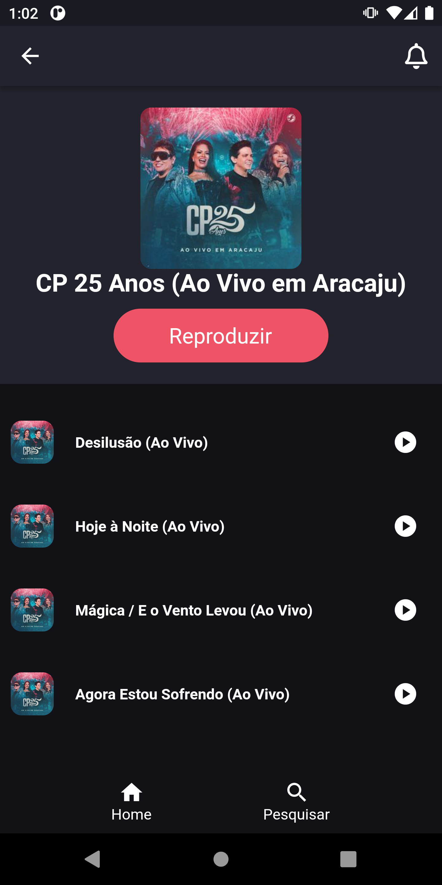
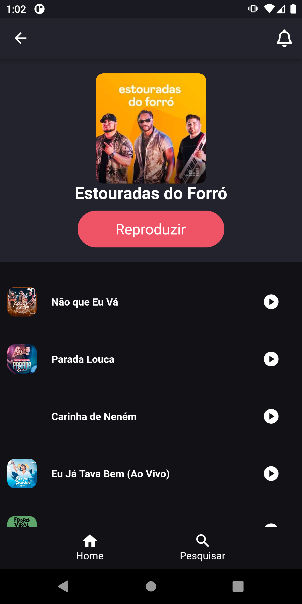
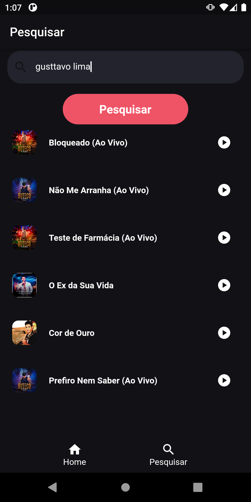

# Desafio 02

O desafio consiste em reproduzir o layout disponibilizado.

## Avisos

Para executar o projeto em sua máquina você deve ter determinados programas instalados, abaixo está cada um deles.

    dart 2.15.1
    flutter 2.8.1
    android studio

<a href="https://docs.flutter.dev/get-started/install">Download dart e flutter</a>

<a href="https://developer.android.com/studio#downloads">Download android studio</a>

## Baixando e executando o projeto

    git clone https://github.com/les-prp-uespi/p4tp-grupo-trabai3.git

    cd p4tp-grupo-trabai3

    flutter run

## Estrutura do projeto

    ├── components
    │ ├── album.dart
    │ ├── header.dart
    │ ├── player.dart
    │ ├── playlist.dart
    │ ├── podcast.dart
    │ └── track.dart
    ├── controllers
    │ └── player_controller.dart
    ├── generated_plugin_registrant.dart
    ├── helpers
    │ ├── choose_height.dart
    │ ├── chose_message.dart
    │ ├── list_widgets.dart
    │ └── message.dart
    ├── main.dart
    ├── models
    │ ├── album.dart
    │ ├── artist.dart
    │ ├── episode.dart
    │ ├── playlist.dart
    │ ├── podcast.dart
    │ └── track.dart
    ├── repositories
    │ ├── album_repository.dart
    │ ├── chart_repository.dart
    │ ├── playlist_repository.dart
    │ ├── podcast_repository.dart
    │ ├── resource.dart
    │ └── search_repository.dart
    ├── routes
    │ └── navigator.dart
    ├── screens
    │ ├── home_page.dart
    │ ├── my_app.dart
    │ ├── result_album.dart
    │ ├── result_playlist.dart
    │ ├── result_podcast.dart
    │ └── search.dart
    └── theme
    └── colors.dart

## Previews

### Home

### Podcast

### Album

### Playlist

### Pesquisa

